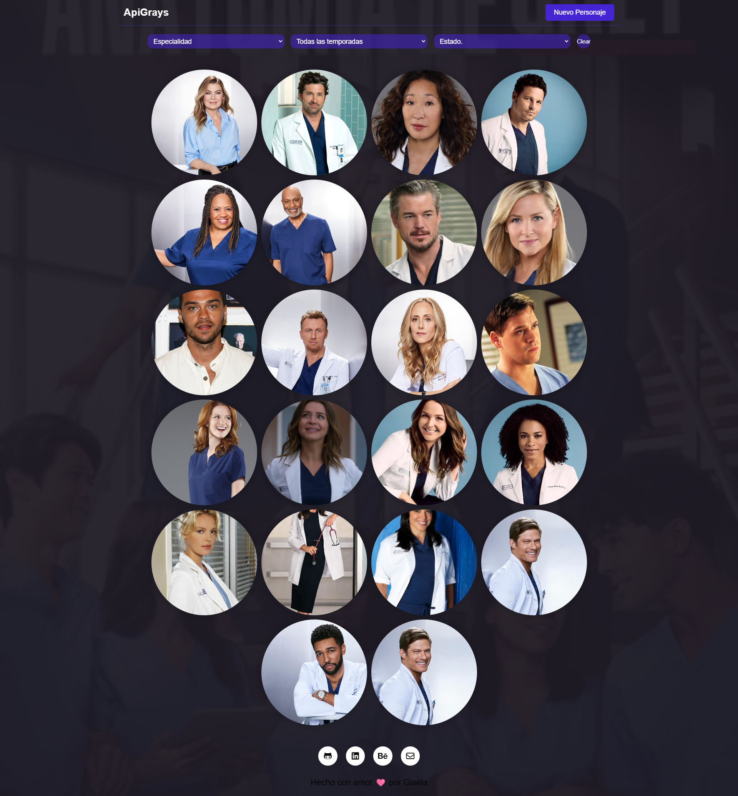

# ¡Bienvenida al Mundo de Grey's Anatomy! 🏥💉

## ¡Descubre el fascinante universo de Grey's Anatomy con nuestra increíble API Web! 🌟



## ¿Qué es este Proyecto? 🤔

 Este proyecto es una ventana al mundo de tus personajes favoritos de la serie. Con nuestra API Web, puedes explorar información detallada de cada uno de ellos, ¡y hasta agregar nuevos personajes que te gustaría ver en la serie!

 
¡Puedes visitar nuestro sitio web [aquí](https://api-greys-anatomy.netlify.app/)!

## ¿Qué Tecnologías Utilizamos? 💻🎨

- HTML
- SASS
- JavaScript


### ¡Diseño a tu Gusto! 🎨
- ¡Totalmente Responsive! 📱

### API: ¡Tu Propio Universo! 🌌

- Utilizamos la API MockAPI.
- Cada alumna tiene su propio endpoint personalizado.
- Métodos: GET, POST, PUT y DELETE.

### ¡Explora el Flow!

1. Carga inicial con navbar, formulario de búsqueda y footer.
2. ¡Spinner mágico durante 2 segundos!
3. Filtrado por categorías para una búsqueda personalizada.
4. ¡Crea nuevos personajes y dales vida!
5. ¡Detalles fascinantes de cada personaje!
6. Edita o elimina personajes con un toque mágico.
7. ¡Opcionalmente, agrega paginación para una experiencia aún mejor!

### Datos Mágicos ✨

¡Nuestros datos siguen una estructura fascinante!

```javascript
const element = [
  {
    "name": "Nombre del personaje",
    "description": "Descripción del personaje",
    "category1": "Categoría 1",
    "category2": "Categoría 2",
    "category3": "Categoría 3",  
    "urlImagen": "string",
    "id": "1"
  }
];
```
